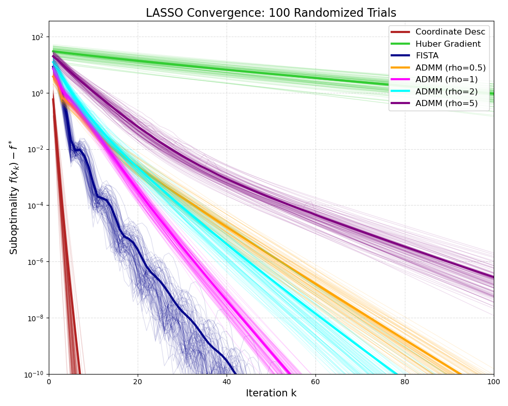
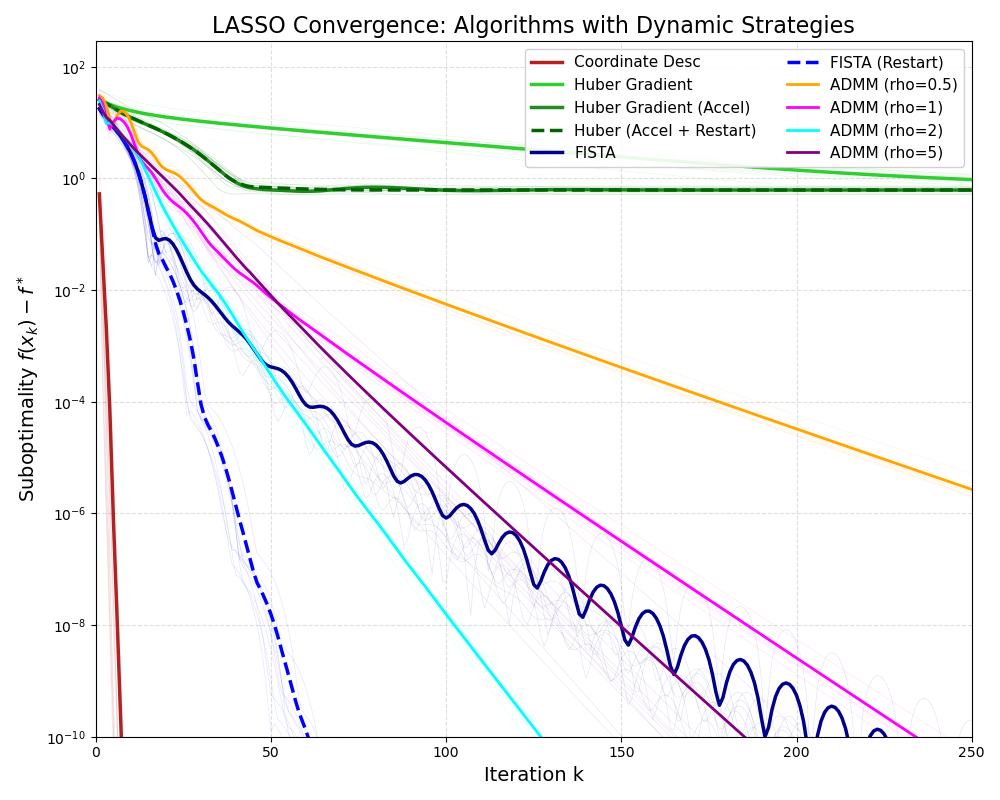

# LASSO Optimization Algorithms Comparison & Analysis
# LASSO 回归优化算法收敛性对比分析

## 📖 项目简介 (Introduction)

本项目通过系统的数值实验，全面比较了多种优化算法及其变体在求解 **LASSO (Least Absolute Shrinkage and Selection Operator)** 回归问题时的收敛性能。研究不仅涵盖了经典算法（如 BCD、FISTA），还深入分析了**动态策略**（如重启机制）以及**关键参数**（如 ADMM 的惩罚参数 $\rho$）对算法收敛速率和稳定性的影响。

此外，为了验证算法的鲁棒性，本项目特别对比了**低维常规** ($n > p$) 与**高维稀疏** ($p \gg n$) 两种不同场景下的表现差异。

目标函数定义为：
$$
\min_{\beta} \frac{1}{2n} \left\Vert y - X\beta \right\Vert_2^2 + \lambda \left\Vert \beta \right\Vert_1
$$

## 🛠️ 实验设置 (Experimental Setup)

为了全面评估算法性能，我们设计了两种实验场景：

| 设置项 | 场景 A：低维常规 (Low-Dim) | 场景 B：高维稀疏 (High-Dim) |
| :--- | :--- | :--- |
| **样本量 ($n$)** | 200 | 200 |
| **特征数 ($p$)** | 50 | **1000** |
| **条件** | Over-determined ($n > p$) | Under-determined ($p \gg n$) |
| **实验次数** | 100 次独立重复 | 10 次独立重复 (因计算耗时) |
| **最大迭代** | 100 | 250 |

* **稀疏性设置**: 真实参数向量中仅前 10 个元素非零。
* **正则化强度**: $\lambda = 0.1 \times \lambda_{\text{max}}$。
* **可视化说明**: 细线表示单次实验轨迹（云图），粗线表示平均轨迹。

## 🚀 实现算法 (Implemented Algorithms)

1.  **Coordinate Descent (BCD)**: 块坐标下降法
2.  **Huber Gradient Descent**: Huber 平滑化的梯度下降法（含加速与重启策略）
3.  **FISTA**: 快速迭代收缩阈值算法（含标准版与重启版）
4.  **ADMM**: 交替方向乘子法（不同惩罚参数对比）

---

## 🎨 曲线含义与图例对照 (Visualization Legend)

下图展示了不同算法的收敛轨迹。为了方便查阅，我们将颜色与算法对应关系整理如下：

| 颜色 (Color) | 线型 (Style) | 算法名称 (Algorithm) | 曲线特征与物理含义 (Characteristics & Interpretation) |
| :--- | :--- | :--- | :--- |
| **🔴 红色** | 实线 | **Coordinate Descent** | **⚡ 统治级表现**。<br>曲线近乎垂直下降。利用 LASSO 的可分性结构，每步精确求解子问题，在极短迭代内达到机器精度。 |
| **🔵 深蓝** | 实线 | **FISTA** | **〰️ 动量震荡 (Ripples)**。<br>虽然下降极快，但在 $10^{-2}$ 到 $10^{-6}$ 区间出现了明显的“锯齿”或“波纹”。这是 Nesterov 动量惯性导致的“过冲”现象。 |
| **🔷 蓝色** | **虚线** | **FISTA (Restart)** | **✅ 震荡消除**。<br>对比实线深蓝，虚线平滑切入更低误差。这证明了**重启策略**成功检测到了动量方向的错误并重置，避免了无谓的震荡。 |
| **🟢 浅绿** | 实线 | **Huber Gradient** | **🐢 线性慢速**。<br>最基础的梯度下降，斜率最缓。受限于平滑逼近的性质，收敛非常慢。 |
| **🌲 深绿** | 实线 | **Huber (Accel)** | **📉 加速受限与平台期**。<br>前期比普通 Huber 快，但随后停滞在 $10^{-2}$ 左右的**误差平台 (Error Floor)**。因为 Huber 只是 L1 的近似，无法收敛到真正的 LASSO 解。 |
| **🌿 深绿** | **虚线** | **Huber (Restart)** | **✂️ 削峰填谷**。<br>虚线成功削去了加速版带来的反弹波峰，下降更平稳，但同样受限于近似误差。 |
| **🌺 品红** | 实线 | **ADMM (rho=1)** | **🏆 综合最佳**。<br>通常是 ADMM 参数中的最佳选择，收敛斜率最陡。 |
| **💧 青色** | 实线 | **ADMM (rho=2)** | **🥈 稳健次席**。<br>收敛速度略慢于 $\rho=1$，但在高维困难问题中表现出更好的鲁棒性。 |
| **🔶 橙色** | 实线 | **ADMM (rho=0.5)** | **🥉 步长过大**。<br>初期下降尚可，后期收敛乏力，出现“拖尾”。 |
| **🍆 紫色** | 实线 | **ADMM (rho=5)** | **🐌 过度惩罚**。<br>斜率最缓。较大的 $\rho$ 限制了变量更新幅度，导致“迟滞”。 |

---

## 📊 场景一：低维情形分析 ($n=200, p=50$)



**核心分析：**
1.  **ADMM 参数敏感性**: 在低维情形下，$\rho=1$ (品红) 表现最佳，完美平衡了原始残差和对偶残差。
2.  **动量步长的动态调整**: 对比 **FISTA (深蓝)** 与 **FISTA-Restart (蓝虚线)**，体现了动态策略的重要性。无重启时，算法在谷底反复震荡；带重启时，算法能自适应截断动量，直线下降。
3.  **Huber 的局限**: 无论如何加速，Huber 方法最终只能停留在 $10^{-2}$ 数量级，无法像近端算法那样达到高精度。

---

## 📈 场景二：高维情形分析 ($n=200, p=1000$)

当特征维度急剧增加 ($p \gg n$)，问题的病态程度加剧（Hessian 矩阵 $X^TX$ 奇异），算法表现发生了显著变化。



**核心分析：**

### 1. 维度灾难下的剧烈震荡 (Severe Oscillation)
请注意 **FISTA (深蓝实线)** 在高维下的表现：震荡幅度比低维时剧烈得多，甚至呈现出大幅度的锯齿状。这是因为在高维病态曲面上，动量的“惯性”更容易将迭代点带偏。
* **对比**: **FISTA-Restart (蓝虚线)** 依然保持了极其平滑的下降曲线。这有力地证明了**在高维复杂问题中，动态重启策略是必不可少的**。

### 2. ADMM 最优参数的漂移 (Parameter Shift)
* 在低维 ($p=50$) 时，$\rho=1$ (品红) 明显最快。
* 在高维 ($p=1000$) 时，**$\rho=2$ (青色)** 的表现反超了 $\rho=1$，或者两者并驾齐驱。
* **物理含义**: 当问题变难（条件数变差）时，稍微增大惩罚力度 ($\rho$) 有助于稳定对偶变量的更新，防止发散。

---

## ⏳ 算法时间复杂度分析 (Time Complexity Analysis)

实验中观察到：当 $p$ 从 50 增加到 1000 时，单次实验耗时从秒级增加到了分钟级。以下是基于算法原理的复杂度分析：

设 $n$ 为样本数，$p$ 为特征数。

| 算法 | 单次迭代复杂度 | 关键瓶颈 (Bottleneck) | 对高维 ($p \gg n$) 的敏感度 |
| :--- | :--- | :--- | :--- |
| **Coordinate Descent** | $O(p \cdot n)$ | 向量内积 (更新残差) | **低 (Linear)**。<br>CD 避免了任何矩阵运算，仅随 $p$ 线性增长，因此在高维下依然飞快。 |
| **FISTA / Gradient** | $O(n \cdot p)$ | 矩阵-向量乘法 $X^T(X\beta - y)$ | **中 (Linear)**。<br>随 $p$ 线性增长，但在 Python 中大矩阵乘法仍有一定开销。 |
| **ADMM** | **$O(p^3)$** (预处理) <br> $O(p^2)$ (迭代) | 线性方程组求解 $(X^TX + \rho I)^{-1}$ | **极高 (Cubic)**。<br>ADMM 需要对 $p \times p$ 的矩阵进行 Cholesky 分解。当 $p=1000$ 时，$p^3 = 10^9$ (十亿次运算)，这是导致运行缓慢的根本原因。 |

**结论**: 虽然 ADMM 理论性质优美，但在单机处理高维特征（$p$ 很大）且样本量较小（$n$ 较小）时，其计算代价远高于坐标下降法。

---

## ⚔️ 深度总结 (Conclusion)

1.  **速度之王：Coordinate Descent**
    无论是在低维还是高维，**块坐标下降法**都展示了统治级的收敛速度和最低的计算代价。对于 LASSO 这类可分问题，CD 是绝对的首选。

2.  **动量是一把双刃剑**
    FISTA 在高维病态问题中极易发生震荡。**带重启策略 (Restart)** 能以极小的代价换取极大的稳定性提升，是动量方法的“安全带”。

3.  **ADMM 的代价与鲁棒性**
    ADMM 对参数 $\rho$ 敏感，且在高维下计算昂贵 ($O(p^3)$)。但它展示了良好的鲁棒性，特别是 $\rho=2$ 在高维下的稳定表现，说明它适合处理约束更复杂的问题，但在纯 LASSO 问题上不如 CD 高效。

## 💻 复现指南

### 环境依赖
```bash
pip install numpy matplotlib scikit-learn
